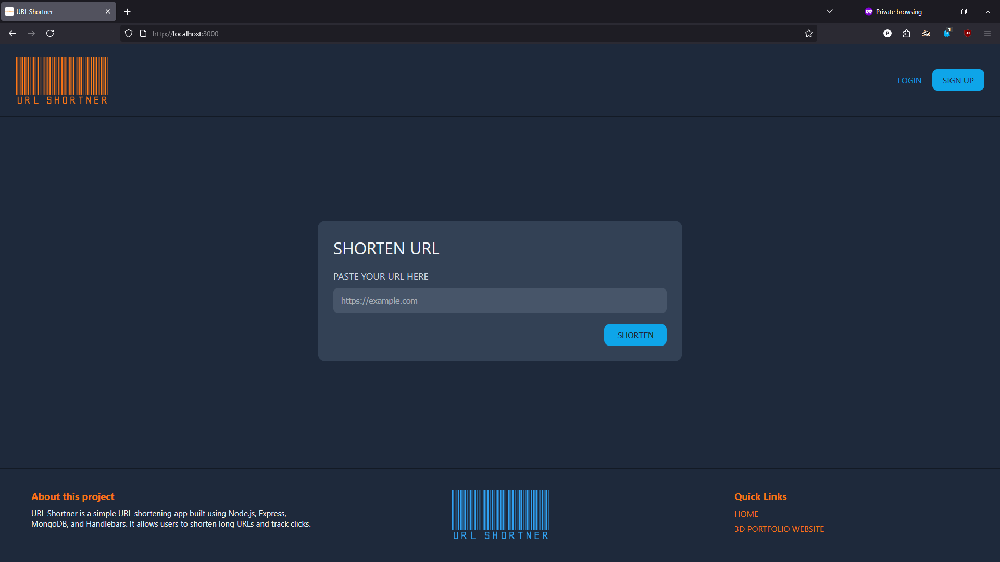
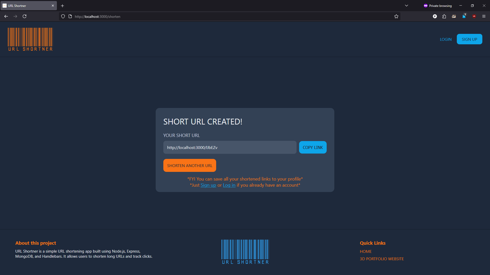
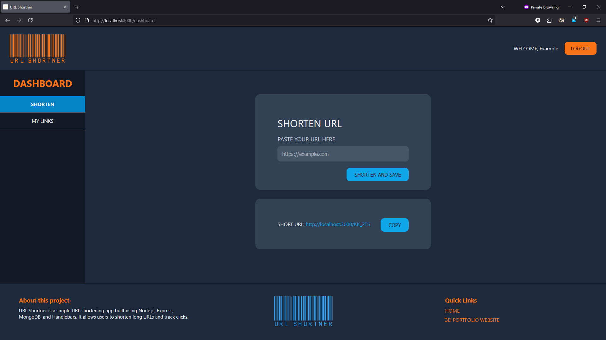
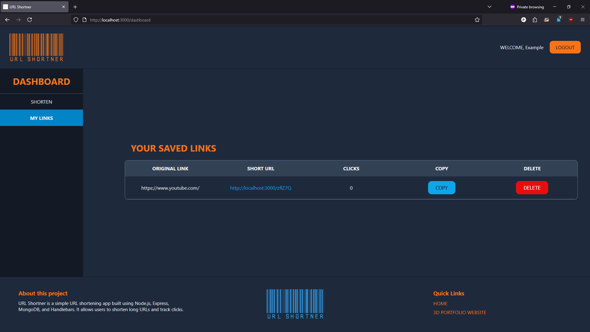

# 🔗 URL Shortener

A full-stack **URL Shortening Web Application** that lets users generate short links, track clicks, and manage their personalized dashboard. Built with **Node.js**, **Express**, **MongoDB**, and **Handlebars**, and deployed using **Docker** and **Kubernetes**.

---
## 🚀 Features

- 🔐 **User Authentication** (Sign up / Log in / Logout)
- ✂️ **Shorten URLs** with a single click
- 📋 **Dashboard** to view, copy, and delete your links
- 📈 **Click Tracking** on each shortened link
- 📦 **AJAX Integration** for smooth, reload-free actions
- 🐳 **Dockerized** for isolated environment setup
- ☸️ **Kubernetes Deployment** for scalability and orchestration

---

## 🛠️ Tech Stack

| Category       | Tech Used                      |
|----------------|-------------------------------|
| **Frontend**   | HTML, CSS, Handlebars          |
| **Backend**    | Node.js, Express.js            |
| **Database**   | MongoDB                        |
| **Auth**       | express-session, bcrypt        |
| **Utilities**  | nanoid, fetch, clipboard API   |
| **DevOps**     | Docker, Kubernetes             |

---

## 📂 Folder Structure

```

url-shortner-k8s/
├── config/              # MongoDB connection config
├── data/                # User handling logic
├── public/              # Static assets (CSS & JS)
├── routes/              # Express route handlers
├── views/               # Handlebars templates
├── k8s/                 # Kubernetes manifests
├── Dockerfile           # Docker setup
├── server.js            # Main app entry
└── package.json

````

---

## ⚙️ Getting Started

### 🔧 Prerequisites

- Node.js and npm
- MongoDB (local or Atlas)
- Docker
- Kubernetes (Minikube or Docker Desktop)

---

### 🖥️ Run Locally

1. **Clone the repository**
   ```bash
   git clone https://github.com/PiyushK-T/url-shortner-k8s.git
   cd url-shortner-k8s
   ```

2. **Install dependencies**

   ```bash
   npm install
   ```

3. **Start MongoDB**

4. **Run the app**

   ```bash
   npm start
   ```

5. Visit: `http://localhost:3000`

---

### 🐳 Docker + Kubernetes

1. **Build Docker image**

   ```bash
   docker build -t url-shortener-app .
   ```

2. **Apply Kubernetes manifests**

   ```bash
   kubectl apply -f k8s/
   ```

3. **Access the app**
   Use `kubectl port-forward` or expose a service via LoadBalancer/NodePort

---

## 📸 Screenshots
### Home Page 


### Result


### Dashboard (Shorten)


### Dashboard (Table)



---

## 📌 Future Improvements

* Support custom (vanity) short URLs
* Show device/IP/country analytics
* Email verification and password reset
* Add rate limiting and bot/spam protection
* Responsive mobile UI enhancements

---

## 🤝 Contributing

Contributions are welcome! Feel free to fork the repo, make changes, and submit a pull request.

---

## 📜 License

MIT © [Piyush Devendra Kataktalware](https://github.com/PiyushK-T)

```
